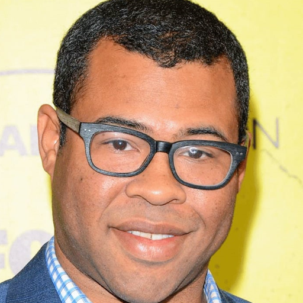
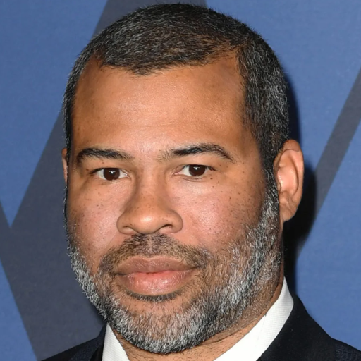

# IP-FVR

## 🎬 Introduction

This repository is the official implementation of Show and Polish: Reference-Guided Identity Preservation in Face Video Restoration.

## **✨**News and ToDo List

- [ ] Release checkpoints.
- [ ] Release code & data.
- [X] [2025-06-19] Init repository.

## Qualitative Experiments

**Reference face scale**

**Observation:** When conducting inference with IP-FVR, more reference faces can lead to higher identity preservation in the restored results.

**Misaligned reference**
<table style="width:100%">
  <tr>
    <td style="width:45%">
      <video controls style="width:100%">
        <source src="assets/align.mp4" type="video/mp4">
        Your browser does not support the video tag.
      </video>
    </td>
    <td style="width:45%">
      <video controls style="width:100%">
        <source src="assets/misalign.mp4" type="video/mp4">
        Your browser does not support the video tag.
      </video>
    </td>
  </tr>
</table>

<table style="width:100%">
  <tr>
    <td style="width:45%">
      
    </td>
    <td style="width:45%">
      
    </td>
  </tr>
</table>

**Observation:** When the reference image is misaligned with the low-quality input video face (e.g., differences in beards), it can affect the results as shown on the right side of the figure above. However, this can be mitigated in practical applications by selecting a more aligned reference image or using facial feature text prompts.